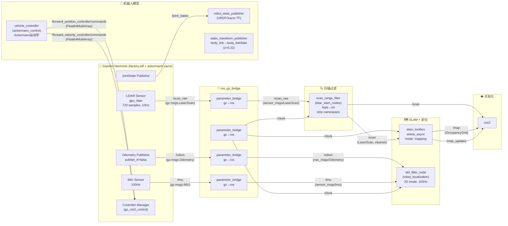
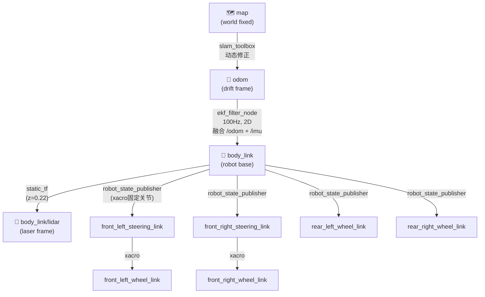

# sim_ackermann.launch.py — 纯SLAM建图架构

## 节点与话题数据流

## TF 树

### TF 发布者汇总

| TF 变换 | 发布节点 | 频率 | 说明 |
|---------|---------|------|------|
| map → odom | slam_toolbox | 动态(50Hz) | SLAM定位修正 |
| odom → body_link | ekf_filter_node | 100Hz | 融合 /odom + /imu, 2D模式 |
| body_link → body_link/lidar | static_transform_publisher | static | 固定偏移 (x:0, y:0, z:0.22) |
| body_link → wheel/steering links | robot_state_publisher | static | 从 URDF/Xacro 读取固定关节 |

## 启动时序

```mermaid
gantt
    title sim_ackermann.launch.py 启动时序
    dateFormat X
    axisFormat %s s

    section 基础层
    Gazebo + Bridge    :a1, 0, 2000
    laser_tf           :a2, 0, 2000
    rviz2              :a3, 0, 2000

    section 机器人层
    ackermann_control  :b1, 2000, 10000

    section 感知层
    scan_range_filter   :b2, 2000, 1000

    section 定位与建图
    ekf_filter         :c1, 5000, 1000
    slam_toolbox       :c2, 5000, 1000
```

### ackermann_control 子启动时序

```mermaid
gantt
    title ackermann_control 内部启动时序
    dateFormat X
    axisFormat %s s

    section 机器人模型
    robot_state_publisher :a0, 0, 1000
    spawn_robot           :a1, 5000, 2000
    load_controllers      :a2, 10000, 3000
    vehicle_controller    :a3, 12000, 1000
```

## 完整节点列表

| 序号 | 节点名 | 包 | 可执行文件 | 启动延迟 | 说明 |
|------|--------|-----|-----------|---------|------|
| 1 | gz_sim (include) | ros_gz_sim | gz_sim.launch.py | 0s | Gazebo Harmonic 仿真世界 |
| 2 | bridge | ros_gz_bridge | parameter_bridge | 0s | Gazebo→ROS2 传感器桥接 |
| 3 | scan_range_filter | lidar_slam_nodes | scan_range_filter | 2s | NaN→inf, 去掉命名空间前缀 |
| 4 | robot_state_publisher | robot_state_publisher | robot_state_publisher | 2s(include内) | 发布机器人关节TF |
| 5 | spawn_robot | ros_gz_sim | create | 7s(include内) | 在Gazebo中生成机器人 |
| 6 | load_controllers | lidar_slam_nodes | load_controllers | 12s(include内) | 加载并激活控制器 |
| 7 | vehicle_controller | ackermann_control | vehicle_controller | 14s(include内) | Ackermann运动学转换 |
| 8 | laser_tf | tf2_ros | static_transform_publisher | 0s | body_link→lidar 静态TF |
| 9 | ekf_filter_node | robot_localization | ekf_node | 5s | 融合 /odom + /imu, 发布 odom→body_link TF |
| 10 | slam_toolbox (include) | slam_toolbox | online_async_launch.py | 5s | SLAM建图, 发布 /map 和 map→odom TF |
| 11 | rviz2 | rviz2 | rviz2 | 0s | 可视化 |

## 话题列表

| 话题 | 消息类型 | 发布者 | 订阅者 |
|------|---------|--------|--------|
| /scan_raw (gz) | gz.msgs.LaserScan | Gazebo LiDAR sensor | ros_gz_bridge |
| /scan_raw (ros) | sensor_msgs/LaserScan | ros_gz_bridge | scan_range_filter |
| /scan | sensor_msgs/LaserScan | scan_range_filter | slam_toolbox, rviz2 |
| /odom | nav_msgs/Odometry | Gazebo OdometryPublisher → ros_gz_bridge | ekf_filter_node |
| /imu | sensor_msgs/Imu | Gazebo IMU sensor → ros_gz_bridge | ekf_filter_node |
| /clock | rosgraph_msgs/Clock | ros_gz_bridge | 所有节点 |
| /joint_states | sensor_msgs/JointState | Gazebo JointStatePublisher | robot_state_publisher |
| /map | nav_msgs/OccupancyGrid | slam_toolbox | rviz2 |
| /map_updates | nav_msgs/OccupancyGrid | slam_toolbox | rviz2 |
| /steering_angle | std_msgs/Float64 | (手动/外部) | vehicle_controller |
| /velocity | std_msgs/Float64 | (手动/外部) | vehicle_controller |
| /forward_position_controller/commands | std_msgs/Float64MultiArray | vehicle_controller | Controller Manager (Gazebo) |
| /forward_velocity_controller/commands | std_msgs/Float64MultiArray | vehicle_controller | Controller Manager (Gazebo) |
