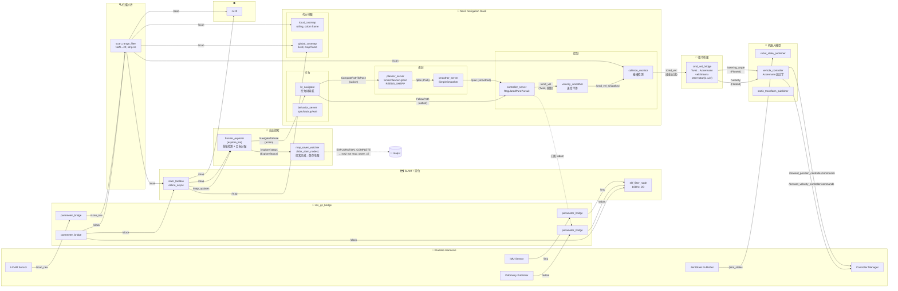
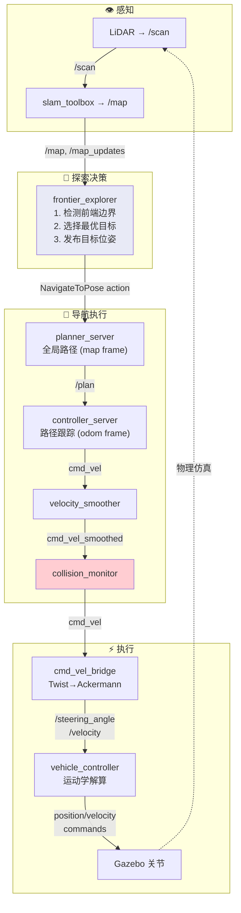
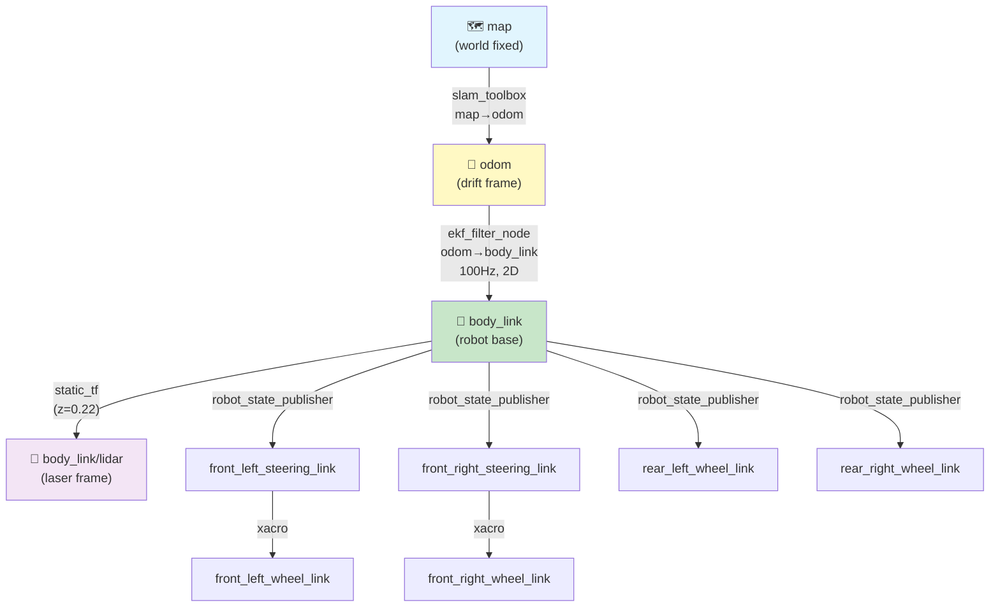

# sim_ackermann_explore.launch.py — 自主探索架构

> 基于 sim_ackermann.launch.py 的 SLAM 基础，新增 Nav2 导航堆栈、前端探索、指令桥接和自动地图保存。

## 节点与话题数据流

## Nav2 内部控制指令链路

```mermaid
flowchart LR
  cs["controller_server<br/>(RegulatedPurePursuit)"]
  vs["velocity_smoother"]
  col["collision_monitor"]
  cvb["cmd_vel_bridge"]
  vc["vehicle_controller"]
  cm["Controller Manager<br/>(Gazebo内部)"]
  wheels["🛞 四轮关节"]

  cs -->|"cmd_vel<br/>(Twist)"| vs
  vs -->|"cmd_vel_smoothed<br/>(限速/平滑)"| col
  col -->|"cmd_vel<br/>(碰撞过滤)"| cvb
  cvb -->|"/steering_angle<br/>(Float64)"| vc
  cvb -->|"/velocity<br/>(Float64)"| vc
  vc -->|"forward_position_controller/commands<br/>(Float64MultiArray, [left,right])"| cm
  vc -->|"forward_velocity_controller/commands<br/>(Float64MultiArray, [left,right])"| cm
  cm -->|"position cmd"| wheels
  cm -->|"velocity cmd"| wheels

  style vs fill:#fff3e0
  style col fill:#ffebee
  style cvb fill:#e8f5e9
```

## 自主探索完整控制闭环

## TF 树

### Nav2 各模块使用的 TF 帧

| 模块 | global_frame | robot_base_frame | 说明 |
|------|-------------|-----------------|------|
| global_costmap | map | body_link | 固定全局代价地图 |
| local_costmap | odom | body_link | 滚动局部代价地图 |
| planner_server | map | body_link | 在 map 帧规划全局路径 |
| controller_server | odom | body_link | 在 odom 帧跟踪路径 |
| bt_navigator | map | body_link | 行为树使用 map 帧 |
| behavior_server | map | body_link | 行为使用 map/odom 帧 |
| collision_monitor | odom | body_link | 碰撞检测使用 odom 帧 |
| frontier_explorer | map | body_link | 前端检测使用 map 帧 |

## 启动时序

```mermaid
gantt
    title sim_ackermann_explore.launch.py 启动时序
    dateFormat X
    axisFormat %s s

    section 基础层
    Gazebo + Bridge       :a0, 0, 2000
    laser_tf              :a1, 0, 2000
    cmd_vel_bridge        :a2, 0, 2000
    rviz2                 :a3, 0, 2000

    section 机器人层
    ackermann_control     :b0, 2000, 10000

    section 感知层
    scan_range_filter     :c0, 2000, 1000

    section 定位与建图
    ekf_filter            :d0, 5000, 1000
    slam_toolbox          :d1, 5000, 1000

    section 导航
    Nav2 navigation       :e0, 25000, 15000

    section 探索
    wait_for_tf           :f0, 30000, 15000
    frontier_explorer     :f1, after f0, 60000
    map_saver_watcher     :f2, after f0, 60000
```

> **注意**: frontier_explorer 和 map_saver_watcher 在 wait_for_tf 成功退出后通过 `RegisterEventHandler(OnProcessExit)` 触发启动。

## 完整节点列表

| 序号 | 节点名 | 包 | 可执行文件 | 启动延迟 | 说明 |
|------|--------|-----|-----------|---------|------|
| 1 | gz_sim (include) | ros_gz_sim | gz_sim.launch.py | 0s | Gazebo Harmonic 仿真世界 |
| 2 | bridge | ros_gz_bridge | parameter_bridge | 0s | Gazebo→ROS2 传感器桥接 |
| 3 | scan_range_filter | lidar_slam_nodes | scan_range_filter | 2s | NaN→inf, 去掉命名空间前缀 |
| 4 | robot_state_publisher | robot_state_publisher | robot_state_publisher | 2s(include内) | 发布机器人关节TF |
| 5 | spawn_robot | ros_gz_sim | create | 7s(include内) | 在Gazebo中生成机器人 |
| 6 | load_controllers | lidar_slam_nodes | load_controllers | 12s(include内) | 加载并激活控制器 |
| 7 | vehicle_controller | ackermann_control | vehicle_controller | 14s(include内) | Ackermann运动学转换 |
| 8 | laser_tf | tf2_ros | static_transform_publisher | 0s | body_link→lidar 静态TF |
| 9 | ekf_filter_node | robot_localization | ekf_node | 5s | 融合 /odom + /imu |
| 10 | slam_toolbox (include) | slam_toolbox | online_async_launch.py | 5s | SLAM建图 + 定位 |
| 11 | **★ navigation (include)** | **nav2_bringup** | **navigation_launch.py** | **25s** | Nav2导航堆栈(全部模块) |
| 12 | **★ cmd_vel_bridge** | **lidar_slam_nodes** | **cmd_vel_bridge** | **0s** | Twist→Ackermann指令转换 |
| 13 | **★ wait_for_tf** | **lidar_slam_nodes** | **wait_for_tf** | **30s** | 等待 body_link→map TF可用 |
| 14 | **★ frontier_explorer** | **explore_lite** | **explore** | **wait_tf后** | 前端检测与探索决策 |
| 15 | **★ map_saver_watcher** | **lidar_slam_nodes** | **map_saver_watcher** | **wait_tf后** | 探索完成自动保存地图 |
| 16 | rviz2 | rviz2 | rviz2 | 0s | 可视化 |

★ = 相比 sim_ackermann 新增

## 话题列表

### 传感器话题 (同 sim_ackermann)

| 话题 | 消息类型 | 发布者 | 订阅者 |
|------|---------|--------|--------|
| /scan_raw (gz) | gz.msgs.LaserScan | Gazebo LiDAR | ros_gz_bridge |
| /scan_raw (ros) | sensor_msgs/LaserScan | ros_gz_bridge | scan_range_filter |
| /scan | sensor_msgs/LaserScan | scan_range_filter | slam_toolbox, costmaps, collision_monitor, rviz2 |
| /odom | nav_msgs/Odometry | Gazebo→ros_gz_bridge | ekf_filter_node, controller_server, velocity_smoother |
| /imu | sensor_msgs/Imu | Gazebo→ros_gz_bridge | ekf_filter_node |
| /clock | rosgraph_msgs/Clock | ros_gz_bridge | 所有节点 |

### 建图话题 (同 sim_ackermann)

| 话题 | 消息类型 | 发布者 | 订阅者 |
|------|---------|--------|--------|
| /map | nav_msgs/OccupancyGrid | slam_toolbox | global_costmap, frontier_explorer, rviz2 |
| /map_updates | nav_msgs/OccupancyGrid | slam_toolbox | frontier_explorer |

### ★ Nav2 导航话题 (新增)

| 话题 | 消息类型 | 发布者 | 订阅者 |
|------|---------|--------|--------|
| /plan | nav_msgs/Path | planner_server | smoother_server, controller_server |
| /cmd_vel (原始) | geometry_msgs/Twist | controller_server | velocity_smoother |
| /cmd_vel_smoothed | geometry_msgs/Twist | velocity_smoother | collision_monitor |
| /cmd_vel (最终) | geometry_msgs/Twist | collision_monitor | cmd_vel_bridge |
| /local_costmap/costmap_raw | nav_msgs/OccupancyGrid | local_costmap | controller_server, behavior_server |
| /global_costmap/costmap_raw | nav_msgs/OccupancyGrid | global_costmap | planner_server, behavior_server |
| /local_costmap/published_footprint | geometry_msgs/PolygonStamped | local_costmap | collision_monitor |
| /collision_monitor_state | diagnostic_msgs/DiagnosticStatus | collision_monitor | (监控) |

### ★ 探索与指令话题 (新增)

| 话题 | 消息类型 | 发布者 | 订阅者 |
|------|---------|--------|--------|
| /steering_angle | std_msgs/Float64 | cmd_vel_bridge | vehicle_controller |
| /velocity | std_msgs/Float64 | cmd_vel_bridge | vehicle_controller |
| /explore/status | explore_lite_msgs/ExploreStatus | frontier_explorer | map_saver_watcher |
| /explore/frontiers | visualization_msgs/MarkerArray | frontier_explorer | rviz2 |
| /explore/goal_pose | geometry_msgs/PoseStamped | frontier_explorer | rviz2 |

### 执行话题 (同 sim_ackermann)

| 话题 | 消息类型 | 发布者 | 订阅者 |
|------|---------|--------|--------|
| /joint_states | sensor_msgs/JointState | Gazebo JointStatePublisher | robot_state_publisher |
| /forward_position_controller/commands | std_msgs/Float64MultiArray | vehicle_controller | Controller Manager |
| /forward_velocity_controller/commands | std_msgs/Float64MultiArray | vehicle_controller | Controller Manager |

### Nav2 Action 接口

| Action | 服务端 | 客户端 |
|--------|--------|--------|
| NavigateToPose | bt_navigator | frontier_explorer |
| ComputePathToPose | planner_server | bt_navigator |
| FollowPath | controller_server | bt_navigator |
| SmoothPath | smoother_server | planner_server |
| Spin / Backup / Wait | behavior_server | bt_navigator |

## 与 sim_ackermann 的关键差异

| 项目 | sim_ackermann | sim_ackermann_explore |
|------|--------------|----------------------|
| Nav2 导航堆栈 | 无 | 有 (planner + controller + smoother + behavior + velocity_smoother + collision_monitor + costmaps) |
| cmd_vel 来源 | 无 (需手动发布 /steering_angle + /velocity) | collision_monitor → cmd_vel_bridge → vehicle_controller |
| 探索决策 | 无 | frontier_explorer (前端检测 + NavigateToPose action) |
| TF 等待 | 无 | wait_for_tf (body_link→map, 120s超时) |
| 地图保存 | 手动 | map_saver_watcher (探索完成自动触发) |
| 启动最长延迟 | t=5s (ekf + slam) | t=30s+ (Nav2 + wait_for_tf + explore) |
| 控制模式 | 手动/外接摇杆 | 全自主闭环 |
